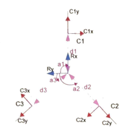

### Modélisation Cinématique et Résolution par Moindres Carrés

#### I. Définition de l'état du système (Torseur Cinématique)
Soit un robot mobile évoluant dans un plan. On définit son vecteur d'état cinématique au centre $G$ par le vecteur colonne $U$ :
$$U = \begin{bmatrix} V_x \\ V_y \\ \omega \end{bmatrix}$$
où $V_x$ et $V_y$ sont les vitesses de translation dans le repère local du robot, et $\omega$ sa vitesse de rotation autour de l'axe vertical $Z$.

Le robot est équipé de $n = 3$ capteurs optiques situés aux points $C_i$. D'après la relation fondamentale de la cinématique des solides (équiprojectivité / torseur cinématique), la vitesse spatiale du point $C_i$ est :
$$\vec{V}_{Ci} = \vec{V}_G + \vec{\omega} \wedge \vec{GC_i}$$

#### II. Projection dans le repère des capteurs (Modèle Direct)
Chaque capteur $i$ est défini par ses coordonnées polaires $(R, \alpha_i)$ dans le repère du robot.
On équipe chaque capteur d'un repère local d'observation $(x_i, y_i)$ où :
* $x_i$ est l'axe radial (orienté vers l'extérieur).
* $y_i$ est l'axe orthoradial (tangentiel, sens anti-horaire).

La projection du vecteur $\vec{V}_{Ci}$ sur ces axes locaux donne le système d'équations :
$$v_{xi} = V_x \cos(\alpha_i) + V_y \sin(\alpha_i)$$
$$v_{yi} = -V_x \sin(\alpha_i) + V_y \cos(\alpha_i) + \omega R$$

On rassemble les mesures des 3 capteurs dans un vecteur d'observation $Z$ de dimension $6 \times 1$ :
$$Z = \begin{bmatrix} v_{x1} \\ v_{y1} \\ v_{x2} \\ v_{y2} \\ v_{x3} \\ v_{y3} \end{bmatrix}$$

Le modèle direct s'écrit sous forme matricielle $Z = H \cdot U$, où $H$ est la matrice d'observation de dimension $6 \times 3$ :
$$H = \begin{bmatrix} \cos(\alpha_1) & \sin(\alpha_1) & 0 \\ -\sin(\alpha_1) & \cos(\alpha_1) & R \\ \cos(\alpha_2) & \sin(\alpha_2) & 0 \\ -\sin(\alpha_2) & \cos(\alpha_2) & R \\ \cos(\alpha_3) & \sin(\alpha_3) & 0 \\ -\sin(\alpha_3) & \cos(\alpha_3) & R \end{bmatrix}$$

#### III. Le Problème Inverse et l'Optimisation Statistique
Nous cherchons à déterminer $U$ à partir de $Z$. Le système a 6 équations pour 3 inconnues, il est donc **surdéterminé**. La matrice $H$ n'étant pas carrée, elle n'est pas inversible.

Au lieu de sélectionner arbitrairement 3 équations (ce qui rendrait le système vulnérable au bruit d'un capteur spécifique), nous cherchons le vecteur $\hat{U}$ qui minimise la somme des carrés des erreurs de mesure $E = ||Z - H \cdot \hat{U}||^2$.

La solution analytique à ce problème d'optimisation est donnée par l'équation normale :
$$H^T Z = (H^T H) \cdot \hat{U}$$
D'où l'on extrait notre estimateur par la pseudo-inverse de Moore-Penrose $H^+$ :
$$\hat{U} = (H^T H)^{-1} H^T Z = H^+ Z$$

#### IV. Résolution Analytique pour la Configuration Symétrique (120°)
Dans notre configuration mécanique, les capteurs sont répartis de manière parfaitement symétrique : $\alpha_1 = 0$, $\alpha_2 = \frac{2\pi}{3}$ et $\alpha_3 = \frac{4\pi}{3}$.

En injectant ces angles, la matrice $H$ devient :
$$H = \begin{bmatrix} 1 & 0 & 0 \\ 0 & 1 & R \\ -1/2 & \sqrt{3}/2 & 0 \\ -\sqrt{3}/2 & -1/2 & R \\ -1/2 & -\sqrt{3}/2 & 0 \\ \sqrt{3}/2 & -1/2 & R \end{bmatrix}$$

Le "miracle" mathématique de cette symétrie à 120° apparaît lors du calcul de la matrice de covariance spatiale $(H^T H)$. Les termes croisés s'annulent parfaitement pour former une matrice diagonale :
$$H^T H = \begin{bmatrix} 3 & 0 & 0 \\ 0 & 3 & 0 \\ 0 & 0 & 3R^2 \end{bmatrix}$$

L'inversion de cette matrice diagonale :
$$(H^T H)^{-1} = \begin{bmatrix} 1/3 & 0 & 0 \\ 0 & 1/3 & 0 \\ 0 & 0 & 1/(3R^2) \end{bmatrix}$$

Il ne reste plus qu'à multiplier ce résultat par $H^T$ pour obtenir la matrice d'extraction finale $H^+$ de dimension $3 \times 6$ :
$$H^+ = \begin{bmatrix} 1/3 & 0 & -1/6 & -\sqrt{3}/6 & -1/6 & \sqrt{3}/6 \\ 0 & 1/3 & \sqrt{3}/6 & -1/6 & -\sqrt{3}/6 & -1/6 \\ 0 & 1/(3R) & 0 & 1/(3R) & 0 & 1/(3R) \end{bmatrix}$$

En développant $\hat{U} = H^+ Z$, 
Ce résultat permet de reconstruire directement :
- la translation
- la rotation

à partir des mesures capteurs.
